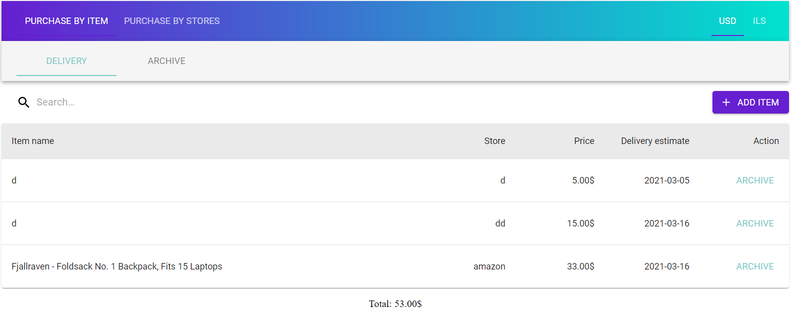
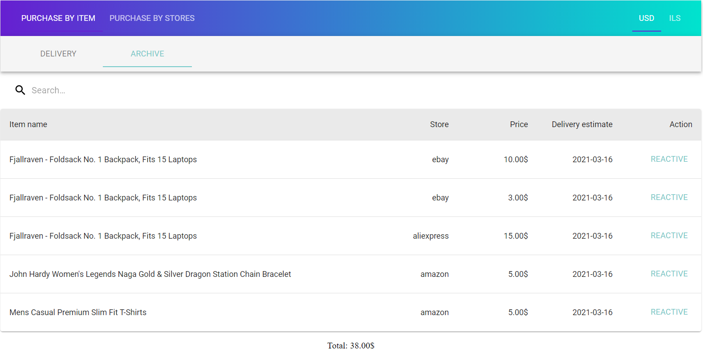
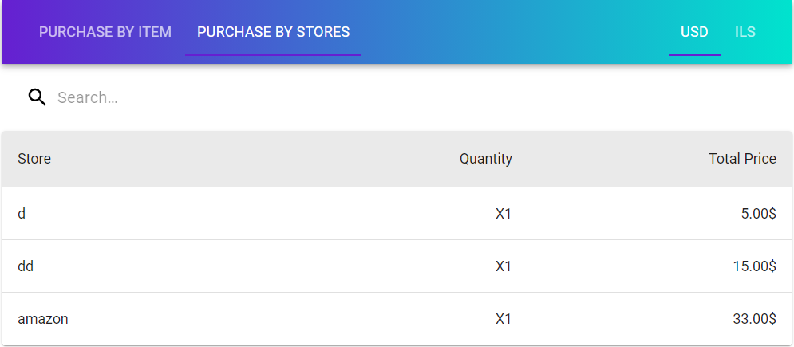
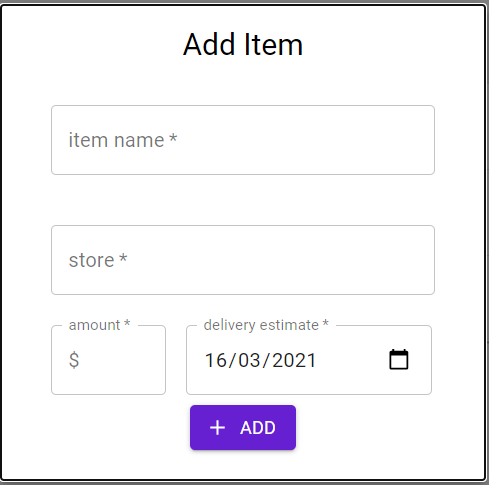
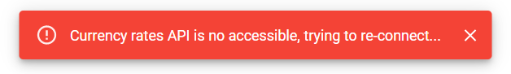
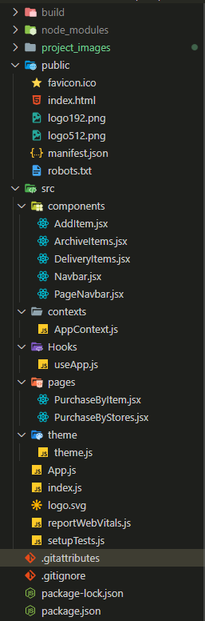
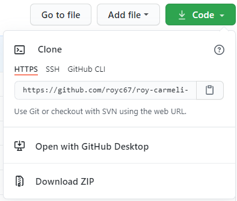

# Shopping Tracking App

A web application designed to track and manage shopping delivery items.

## App usage

Delivery Items Page:



Archive Items Page:



Purchase By Store Page:



Add Item:



Error Message:



<br/>
<br/>

## Project Structure

<br/>

<br/>

## Libraries Used:

- @material-ui/core: ^4.11.3,
- @material-ui/icons: ^4.11.2,
- @material-ui/lab: ^4.0.0-alpha.57,
- @testing-library/react: ^11.1.0,
- @testing-library/user-event: ^12.1.10,
- classnames: ^2.2.6,
- local-storage: ^2.0.0,
- react: ^17.0.1,
- react-dom: ^17.0.1,
- react-router-dom: ^5.2.0,
- react-scripts: 4.0.3,
- uuid: ^8.3.2,

## How to install?

- clone the project to your desktop:


<br/>
<br/>
- install project dependencies

```sh
npm i --save
```

- Run a local development server:

```sh
npm start
```

# Enjoy
